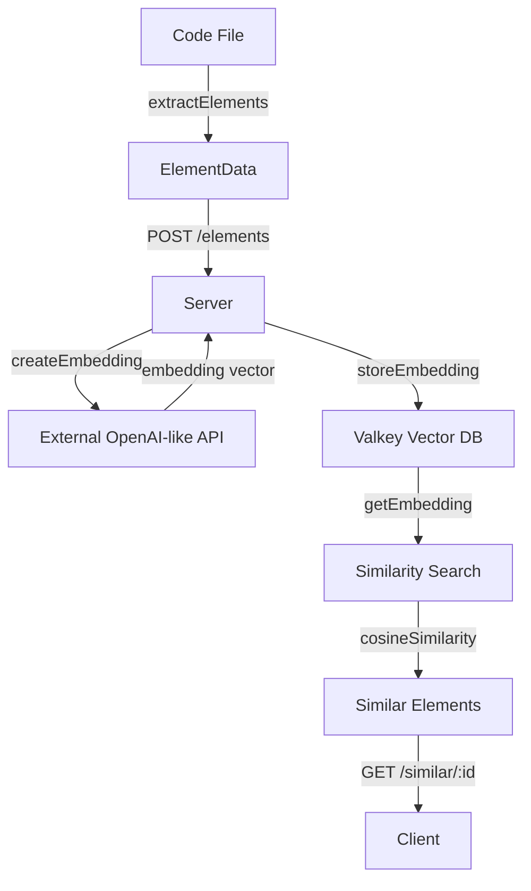

# DRY Detection System

Extract and index code elements (functions, methods, etc.) from your codebase. Compare embeddings to find similar elements and detect duplicate or near-duplicate code.

The system consists of a **Client** (npm package) for extracting elements and a **Server** (Dockerized) for managing embeddings and similarity search using Valkey.

## Architecture



## Quick Start

### 1. Start the Server

The server includes a Valkey instance and an EmbeddingGemma embedding model by default using Docker Compose models.

**Prerequisites:**
- Docker Compose v2.38 or later
- Docker Model Runner (DMR) enabled, or a platform that supports Compose models

1. Start the infrastructure using Docker Compose:
   ```bash
   docker compose up --build
   ```

   This will start:
   - **Valkey** (vector database) on port 6379
   - **EmbeddingGemma** (embedding model via Docker Model Runner)
   - **DRY Server** on port 3000

2. **Optional**: To use an external embedding provider instead, set the environment variable:
   ```bash
   EMBEDDING_API_URL=https://api.openai.com/v1/embeddings docker compose up
   ```

The server will be available at `http://localhost:3000`.

### 2. Setup the CLI

For local development, build and link the package:

```bash
cd dry
bun install          # or npm install
npm run link         # Builds and links the package globally
```

This makes the `dry` command available system-wide.

### 3. Use the CLI

After linking, you can use the tool:

```bash
# Scan a file or directory and index its elements
dry scan src/my-file.ts --url http://localhost:3000

# Scan an entire directory
dry scan src/ --url http://localhost:3000

# Scan with custom regex pattern
dry scan src/ --regex "function\s+(\w+)" --url http://localhost:3000

# Scan and automatically list similar elements after indexing
dry scan src/ --list-similar --threshold 0.85 --limit 10

# Or with npx (works after npm link)
npx dry scan src/ --url http://localhost:3000

# Find elements similar to a previously indexed element ID
dry similar <element-id> --threshold 0.85 --limit 5
```

**Alternative**: If you don't want to link globally, you can run directly:
```bash
# Using bun (if available)
bun src/cli.ts scan src/ --url http://localhost:3000

# Using node (after building)
node dist/cli.js scan src/ --url http://localhost:3000
```

**Note**: The `scan` command automatically wipes all previously indexed elements before scanning to ensure a clean state.

## Development

### Client Library Usage

Install dependencies and use the programmatic API:

```typescript
import { extractElements, DryClient } from '@cc-db/dry';

const client = new DryClient('http://localhost:3000');

// 1. Extract elements from a file (supports multiple regex patterns)
const elements = extractElements('src/utils.ts', [
  /\bfunction\s+(\w+)\s*\(/g,
  /\bconst\s+(\w+)\s*=\s*\([^)]*\)\s*=>/g
]);

// 2. Wipe previous scans (optional)
await client.wipeAllElements();

// 3. Index elements
for (const element of elements) {
  const id = await client.submitElement(element);
  console.log(`Indexed: ${element.metadata.elementName} (ID: ${id})`);
}

// 4. Find duplicates for a specific element
const elementId = 'some-element-id';
const similar = await client.findSimilar(elementId, 0.9, 10);
if (similar.length > 0) {
  console.log(`Found potential duplicates:`);
  similar.forEach(el => console.log(`  - ${el.metadata.elementName}`));
}

// 5. Find most similar pairs across all elements
const pairs = await client.findMostSimilarPairs(0.85, 10);
pairs.forEach(pair => {
  console.log(`Similarity: ${(pair.similarity * 100).toFixed(1)}%`);
  console.log(`  ${pair.element1.metadata.elementName} <-> ${pair.element2.metadata.elementName}`);
});
```

### Data Structures

#### ElementData
```typescript
interface ElementMetadata {
  filePath: string;
  lineNumber: number;
  elementName: string;
}

interface ElementData {
  metadata: ElementMetadata;
  elementString: string;
}
```

#### EmbeddingIndex
```typescript
interface EmbeddingIndex {
  id: string;
  elementData: ElementData;
  embedding: number[];
}
```

## API Reference

### Server Endpoints

- `POST /elements` - Submit an element for indexing. Returns `{ id: string }`
- `DELETE /elements` - Delete all indexed elements. Returns `{ success: boolean, deletedCount: number }`
- `GET /similar/:id` - Find elements similar to a given element ID. Query params: `threshold` (0-1), `limit` (number). Returns `{ similarElements: ElementData[] }`
- `GET /similar/all` - Find most similar element pairs across all elements. Query params: `threshold` (0-1), `limit` (number). Returns `{ pairs: SimilarPair[] }`
- `GET /health` - Health check endpoint. Returns `{ status: 'ok', timestamp: string }`

### Client Methods

- `submitElement(elementData: ElementData): Promise<string>` - Submit an element and return its ID
- `wipeAllElements(): Promise<number>` - Delete all elements and return the count
- `findSimilar(id: string, threshold?: number, limit?: number): Promise<ElementData[]>` - Find similar elements to a given ID
- `findMostSimilarPairs(threshold?: number, limit?: number): Promise<SimilarPair[]>` - Find most similar pairs across all elements

## Configuration

### Server Environment Variables
- `PORT`: Server port (default: `3000`)
- `EMBEDDING_API_URL`: URL for the embedding API (OpenAI-compatible). Defaults to the EmbeddingGemma model URL provided by Docker Model Runner. Override to use an external provider.
- `EMBEDDING_API_KEY`: Authentication key for the API (optional, not required for local EmbeddingGemma model)
- `EMBEDDING_MODEL`: Model name to use (default: `text-embedding-3-small`)
- `VALKEY_URL`: Connection string for Valkey (default: `redis://valkey:6379` in Docker, `redis://localhost:6379` otherwise)

### Docker Compose Models

The configuration uses Docker Compose models to run the EmbeddingGemma model. The model is defined in the `models` section and automatically provides an OpenAI-compatible API endpoint. See the [Docker Compose models documentation](https://docs.docker.com/ai/compose/models-and-compose/) for more details.

### CLI Options

#### Global Options
- `-v, --verbose`: Show verbose output (per-file scanning details)
- `-q, --quiet`: Show only warnings and errors
- `--silent`: Show no output
- `--debug`: Show debug output (element-level details and API interactions)

#### `scan` command
- `--url, -u`: Server endpoint (default: `http://localhost:3000`)
- `--regex, -r`: Regex pattern to match element signatures (overrides config)
- `--extensions, -e`: Comma-separated file extensions to scan (overrides config)
- `--list-similar`: List the most similar elements after scanning (default: `true`)
- `--threshold`: Similarity threshold for listing similar elements (0-1, default: `0.8`)
- `--limit`: Maximum number of similar pairs to list (default: `10`)

#### `similar` command
- `--url, -u`: Server endpoint (default: `http://localhost:3000`)
- `--threshold, -t`: Similarity threshold (0-1, default: `0.8`)
- `--limit, -l`: Maximum number of results (default: `10`)

### Configuration (`dry-scan.toml`)

The CLI looks for a `dry-scan.toml` file in the current or parent directories. If scanning a directory without a config file, the CLI can auto-detect file extensions and prompt to create a config file.

```toml
[server]
url = "http://localhost:3000"

[logging]
# Log levels: silent, error, warn, info, verbose, debug
level = "info"

[scan]
extensions = ["ts", "tsx", "js", "jsx", "py", "go"]
use_ignore_files = [".gitignore", ".dockerignore", ".dryignore"]

[scan.similarity]
threshold = 0.8
limit = 10

[[scan.patterns]]
# Language-specific regex patterns for element extraction
# Each group can apply to multiple extensions
# If the first capture group exists, it's used as the element name
extensions = ["ts", "tsx", "js", "jsx"]
include = [
  "\\bfunction\\s+(\\w+)\\s*\\(",                   # function name() { ... }
  "\\bconst\\s+(\\w+)\\s*=\\s*\\([^)]*\\)\\s*=>",   # const name = () => { ... }
  "\\b(\\w+)\\s*:\\s*function\\s*\\("                # name: function() { ... }
]

[[scan.patterns]]
extensions = ["py"]
include = [
  "^\\s*def\\s+(\\w+)\\s*\\(",                      # def name(...):
  "^\\s*async\\s+def\\s+(\\w+)\\s*\\("              # async def name(...):
]

[[scan.patterns]]
extensions = ["go"]
include = [
  "\\bfunc\\s+(\\w+)\\s*\\(",                       # func name(...) {
  "\\bfunc\\s+\\([^)]+\\)\\s+(\\w+)\\s*\\("         # func (receiver) name(...) {
]
```

**Configuration options:**
- `[server].url`: DRY server endpoint
- `[logging].level`: Default log level
- `[scan].extensions`: File extensions to scan (without the dot)
- `[scan].use_ignore_files`: List of files (like `.gitignore`) to load additional ignore patterns from
- `[scan].similarity.threshold`: Default similarity threshold (0-1)
- `[scan].similarity.limit`: Default limit for similar results
- `[[scan.patterns]]`: List of syntax pattern groups (each with `extensions`, `include`, and optional `exclude`)
